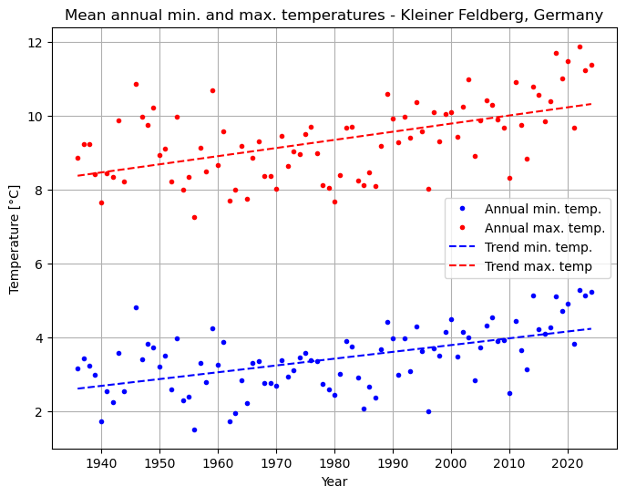

## Earth Data Analytics Projects

### First interactive map

The Frankfurt Airport is the busiest airport by passenger transport in Germany and one of the busiest in Europe (6th place). 
In addition, it is the busiest airport in Europe by cargo traffic. 
Even though it is one of the largest airports in Europe, it is located close to the city of Frankfurt am Main and can be reached in no time by car or public transport.

<embed type="text/html" src="img/ffm_airport.html" width="600" height="600">

### Climate Change - Kleiner Feldberg, Germany

The Kleiner Feldberg is the second-highest mountain in the Taunus mountain range with an elevation of 826 m (2,710 ft), right next to largest montain called Großer Feldberg.
On the top of the Kleiner Feldberg, there is the Taunus Observatory, which was build in 1913 and is still in use for meteorologocal and geophysical measurements. This station was selected because it is close to my home town of Frankfurt.

The annual averages daily maximum and minimum temperatures are displayed in the following plot.
The year 1945 has significantly fewer observation days, covering only about 16% of the year. In 1946, about 75% of the year is covered. 
Since 1945 in particular cannot represent the annual average, we will not consider this year for the trend analysis and they are not displayed.

<embed type="text/html" src="img/annual_kl_feldberg_temperatures-2.html" width="450" height="350">

A **linear regression using the least squares method (OLS)** was performed on the annual average values of the daily maximum and minimum temperatures in order to obtain the temperature trend (see following plot).
The plot alone gives the impression that the trends for annual averaged maximum and minimum temperatures are slightly different. 
Looking at the slopes, the maximum temperature rises by around **0.0221 degrees per year** over the period, and the minimum temperature by around **0.0184 degrees per year**.

The results of this analysis, with a stronger increase in the trend of maximum temperatures than in the trend of minimum temperatures, indicate an increase in diurnal temperature range (DTR). 
This is in line with the most recent research in DTR, showing an increase in DTR, mainly due to accelerated warming of the maximum daily temperature. This is thought to be related to a decrease in global cloud cover and the associated increase in solar radiation.

Further details on the analysis and conclusion can be found in the linked notebook. 

[back](./)
