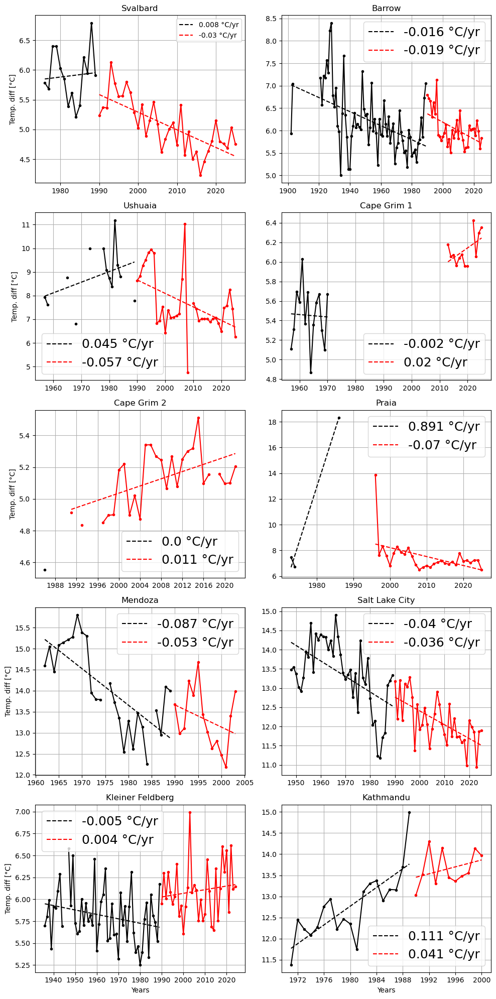

## Earth Data Analytics Projects

### First interactive map

The Frankfurt Airport is the busiest airport by passenger transport in Germany and one of the busiest in Europe (6th place). 
In addition, it is the busiest airport in Europe by cargo traffic. 
Even though it is one of the largest airports in Europe, it is located close to the city of Frankfurt am Main and can be reached in no time by car or public transport.

<embed type="text/html" src="img/ffm_airport.html" width="600" height="600">

### [Climate Change - Kleiner Feldberg, Germany](portfolio_post/climate_change_portfolio_kleiner_feldberg_20250930.html)

The Kleiner Feldberg is the second-highest mountain in the Taunus mountain range with an elevation of 826 m (2,710 ft), right next to largest montain called Großer Feldberg.
On the top of the Kleiner Feldberg, there is the Taunus Observatory, which was build in 1913 and is still in use for meteorologocal and geophysical measurements. This station was selected because it is close to my home town of Frankfurt.

The annual averages daily maximum and minimum temperatures are displayed in the following plot.
The year 1945 has significantly fewer observation days, covering only about 16% of the year. In 1946, about 75% of the year is covered. 
Since 1945 in particular cannot represent the annual average, we will not consider this year for the trend analysis and they are not displayed.

<embed type="text/html" src="img/annual_kl_feldberg_temperatures-4.html" width="500" height="350">

A **linear regression using the least squares method (OLS)** was performed on the annual average values of the daily maximum and minimum temperatures in order to obtain the temperature trend (see following plot).
The plot alone gives the impression that the trends for annual averaged maximum and minimum temperatures are slightly different. 
Looking at the slopes, the maximum temperature rises by around **0.0221 degrees per year** over the period, and the minimum temperature by around **0.0184 degrees per year**.

The results of this analysis, with a stronger increase in the trend of maximum temperatures than in the trend of minimum temperatures, indicate an increase in diurnal temperature range (DTR). 
This is in line with the most recent research in DTR, showing an increase in DTR, mainly due to accelerated warming of the maximum daily temperature. This is thought to be related to a decrease in global cloud cover and the associated increase in solar radiation.

Further details on the analysis and conclusion can be found in this [linked notebook](portfolio_post/climate_change_portfolio_kleiner_feldberg_20250930.html) (as link in the headline). 

### [Annual Migration Patterns of the Canada Goose](portfolio_post/migration_portfolio_canada_goose.html)

The Canada goose (Branta canadensis) has a black head and neck, white cheeks, white under its chin, and a brown body. 
Even though the name suggests its origin, it is more widespread than one might think. 
It is native to the arctic and temperature regions of North America, but can be found 
in Europe, New Zealand, Japan, Chile, Argentina,and the Falkland Islands (Long, 1981).

In the chracteristic V-formation, they fly to their wintering grounds and their breeding grounds in winter,
often a symbol used for the changing seasons in North America. 
The migration routes of the Canada goose are not genetically determined, but are passed down within the various subpopulations. 
Young geese learn the migration route and the location of their winter quarters during migration with their parents. 
Some of the most southerly subpopulations are resindet birds or partial migrants, while more northerly ones are distinct migratory. 
Thus, some of the more northerly populations sometimes pass their sourthern populations that remain closer to their breeding grounds and spend the winter month much further south.

This brief analysis of the migration of the Canada goose is based on the <a href="https://www.gbif.org" target="_blank">GBIF</a> database from 2024.
This year's occurrences were linked to maps of the ecoregions and then grouped by ecoregion and month. 
Very rare occurrences (three or fewer) were excluded from the analysis. 
In addition, the grouped occurrences were normalized to the size of the ecoregions.
The occurrences were also normalized spatially and temporally.
The details to this analysis can be found in [this linked notebook](portfolio_post/migration_portfolio_canada_goose.html) (as link in the headline). 

The following plot shows the normalized occurrences per ecoregion and month of the year. 

<embed type="text/html" src="img/canada_goose_2.html" width="600" height="400">

It can be seen that, based on the GBIF database, the occurrences are mainly limited to North America, Europe, and New Zealand. This agrees with the literature, which identifies these as the main areas of occurrence (e.g. <a href="https://www.thoughtco.com/canada-goose-bird-facts-4584329" target="_blank">Canada Goose Facts</a>).
The Canada goose was introduced to England as early as the 17th century. In the 19th century, the Canada goose was also recorded as ornamental poultry on the European mainland. In New Zealand, however, the Canada goose was introduced not as ornamental poultry but as game for hunting. 

I would like to highlight a few special features that stood out in the graphic representation of the migration: 
- In North America and Europe, there is a noticeable migration toward higher northern latitudes during the summer months. However, a certain number always remain in southern latitudes. This reflects the mixture of different subspecies and their migration patterns. Some of the most southerly subpopulations are resindet birds or partial migrants, while more northerly ones are distinct migratory which migrates to warmer regions in the south during winter. 
- The occurrences in New Zealand are relatively consistent throughout the year, indicating that there is little migration there. Migration here occurs more from the South Island to the North Island and vice versa. 
- Particularly in June, a considerably higher occurrence can be observed in the southern part of Hudson Bay and James Bay. A very recent publication by <a href="https://nsojournals.onlinelibrary.wiley.com/doi/full/10.1002/wlb3.01062" target="_blank">Sorais et al. (2023)</a> described movement patterns and habitat use of molt migrant Canada geese along the east coast of James Bay. They report that the number of Canada geese breeding in temperate zones along the Atlantic and Mississippi flyways has increased significantly since the 1980s. Geese spent 2.8 ± 0.6 days (mean ± standard error of the mean) at 3.2 ± 0.6 resting places (mainly mudflats and salt marshes) from the first week of June in spring and 3.8 ± 1.8 days at 2.0 ± 0.5 resting places (mainly inland waters, moors, and mudflats) from the first week of September on their return south. The increased occurrence in June in particular coincides with the GBIF occurrences.

A detailed analysis of the migration behavior of Canada geese would be very interesting. To this end, it would be useful to have longer records covering several years in order to identify changes in migration patterns caused by factors such as climate change and hunting behavior, e.g. populatioin change due to more hunting of Canada geese.

### [Vegetation change in the Everglades National Park - 2000 to 2024](portfolio_post/vegetation_portfolio_20251126.html)

(Source: National Park Service, https://www.nps.gov/articles/000/everglades-national-park-south-florida.htm)

The Everglades Natioanl Park is an approximalty 1.5 million acres area at the southern tip of Florida which consist of 
sawgrass marshes, cypress swamps, hardwood hammokcs, pine rocklands, and extensive mangrove forests ([National Park Service, U.S. Department of the Interior](https://www.npshistory.com/publications/ever/brochures/2015.pdf)).

<embed type="text/html" src="img/everglades_satellite.html" width="600" height="400">

Climate change may greatly reshape Everglades National Park by flooding areas through rising sea levels, allowing saltwater to invade and harm its freshwater marshes, and increasing the frequency and severity of hurricanes that can erode shorelines and damage ecosystems.

In this brief analysis, we examine the health of Everglades National Park based on the NDVI, covering the period from 2000 to 2024.
The focus was placed on the month of September, following the hottest days of summer and the peak season for tropical storms and hurricanes
The NDVI is a measure used to quantify the density and health of vegetation, and values range from -1 to 1 where low values corresponds to rocks or exposed soil 
and high values indigates greener vegetation, e.g. forests and wetlands ([NDVI](https://www.earthdata.nasa.gov/topics/land-surface/normalized-difference-vegetation-index-ndvi)).

The details to this analysis can be found in [this linked notebook](portfolio_post/vegetation_portfolio_20251126.html) (as link in the headline).
The highlights are presented below. 

A split of the time series and comparison of the periods 2000 to 2012 and  2013 to 2024 shows that coastal areas and areas adjacent to urban and 
metropolitan areas of the national park in particular show a decrease  in NDVI, while central areas of the park show an increase in NDVI.
Because the Everglades sit at a very low elevation, even slight sea-level rise can have major impacts. Saltwater can move farther into freshwater marshes and kill freshwater plants, while higher sea levels can raise groundwater levels and increase vegetation in the park’s interior

<embed type="text/html" src="img/everglades_diff.html" width="600" height="400">

The time series of NDVI values was compared inside and outside the National Park, showing larger values of NDVI
inside the Park than outside. This is also due to the fact that there is an 
urban area adjacent to the national park.
The following shows the difference between inside and outside the park. 

<embed type="text/html" src="img/everglades_in_out_diff.html" width="500" height="400">

Severals years show substantial decrease of the difference. 
In 2017 in particular, there was a more drastic decline in the difference compared to previous and subsequent years. 
This is the year, where hurricane Irma striked the Everglades with landfall as a Category 4 storm.
On September 10, the hurricane moved northward through Florida and Georgia and did extensive damage to the forest canopy
([USGS](https://www.usgs.gov/special-topics/lcmap/science/lcmap-change-stories-hurricanes-everglades) and the following satellite image).

(Source: NOAA weater service,  https://www.weather.gov/mfl/hurricaneirma)

### [Comparison of daily temperature variability trends from various stations distributed globally](portfolio_post/climate_final_project.html)

Global climate change is altering temperature conditions and influencing water and carbon exchange in ecosystems. An important indicator is the daily temperature range (DTR), i.e., the difference between day and night temperatures. Earlier studies (Kar et al., 1993) mostly reported declining DTR trends, while more recent studies (Zhong et al., 2023; Liu et al., 2024) suggest a shift toward mostly increasing trends since the late 1980s to early 1990s. Using measurement stations distributed worldwide, the planned study will evaluate how DTR trends differ at different locations, determine whether there is an overall positive or negative trend, and compare these results with those from the current literature.

Climate Data were taken from
Meteorological data was taken from [Global Historical Climatology Network daily (GHCNd)](https://www.ncei.noaa.gov/products/land-based-station/global-historical-climatology-network-daily#:~:text=The%20Global%20Historical%20Climatology%20Network,suite%20of%20quality%20assurance%20reviews.).
Ten stations were selected, distributed globally and marked in the map below.

<embed type="text/html" src="img/station_overview.html" width="600" height="400">

The details to this analysis can be found in [this linked notebook](portfolio_post/climate_final_project.html) (as link in the headline). This includes the analysis of seasonal and annual trends. In the following, we will only discuss the annual trends. 

Annual trends were calculated only for years with fewer than 60 missing days, except for Ushuaia and Praia, due to limited data. Following Zhong et al. (2023), each station’s time series was split into pre-1990 and post-1990 periods, revealing that many stations exhibit notable or even reversed trend changes between the two intervals.

Annual trends from the stations:

| Station   | Before 1990 [°C/decade] | After 1990 [°C/decade]  |
| :-------  | :------: | -------: |
| Svalbard  | 0.08   | -0.3  |
| Barrow    | -0.16  | -0.19|
| Salt Lake City  | -0.4 | -0.36 |
| Kleiner Feldberg| -0.05| 0.04 |
| Kathmandu | 1.11 | 0.41 |
| Praia     | -  | -0.7 |
| Mendoza   | -0.87  | -0.53 |
| Ushuaia   | 0.45 | -0.57 |
| Cape Grim 2 | -0.02 | 0.2 |
| Cape Grim 2 | -  | 0.11 |

Most stations show a negative DTR trend after 1990, seemingly contradicting recent studies that report a shift to positive trends. However, when comparing these station-level results with the spatial trend patterns in the GSOD dataset (1991–2020) presented by Zhong et al. (2023), the findings are generally consistent.

(Source: Zhong et al. (2023): Reversed asymmetric warming of sub-diurnal temperature over land during recent decades)

### [Vegetation data to estimate depression prevalence in Seattle](portfolio_post/portfolio_urban_greenspace.html)

Increasing urbanization has raised concerns about mental health, highlighting the importance of urban green spaces. Although evidence suggests that green spaces may reduce the risk of depression and anxiety, uncertainties remain about the strength and consistency of this relationship. A recent meta-analysis by [Liu et al., 2023](https://www.sciencedirect.com/science/article/abs/pii/S0013935123011076) found that greater green space coverage and higher NDVI levels are associated with lower risks of depression and anxiety. Seattle, a U.S. city with relatively high depression prevalence, also faces climate-related stressors such as flooding, pollution, and wildfire smoke that may further affect residents’ mental health. This analysis examines the relationship between depression prevalence and urban green space in Seattle by calculating landscape metrics—patch, edge, and fragmentation—using depression data from the [CDC PLACES](https://www.cdc.gov/places/index.html) dataset and urban green space imagery from the Microsoft Planetary Computer STAC catalog.
The details to this analysis can be found in [this linked notebook](portfolio_post/portfolio_urban_greenspace.html) (as link in the headline)

The U.S Center for Disease Control (CDC) provides severeal health variables through their [Places Dataset](https://www.cdc.gov/places/index.html).
Here we look at the adult depression for Seattle. 
Thd following plot shows the depression prevalence in Seattle census tracts. 

<embed type="text/html" src="img/depression_census.html" width="600" height="400">

The map reveals data gaps in some census tracts. Higher depression prevalence appears west of the airport and industrial areas and in north-central Seattle, but without clear clustering.
I first suggestion is that pollution from industrial activity and the airport may play a role, though lower depression rates east of these areas suggest other factors are involved. 
Higher depression rates also tend to coincide with higher crime levels.
To determine the relationship between depression and urban green spaces, we use data from the Microsoft Planetary Computer SpatioTemporal Access Catalog (STAC) and calculate the metrics percentage vegetation, mean patch size, and edge density. The follwing plots show again the depression prevalence but also the vehetation edge density of Seattle 

<embed type="text/html" src="img/ndvi_census.html" width="600" height="400">

Comparing these two figures, a direct correlation cannot be immediately discerned. 
In general, census tracts with higher prevalence also have slightly higher values in vegetation edge density. 

In the final step, we test the possibility of determining depression prevalence from vegetation metrics. 
For this, we use the linear ordinary least squares (OLS) regression. 
The most suitable data from our vegetation dataset are edge density and mean patch size, with mean patch size being logarithmically transformed to eliminate excessive skewness
(see individual steps in the [this notebook](portfolio_post/portfolio_urban_greenspace.html)).

Predicted and actual depression data were finally compared to determine the quality of the model. The following figure shows the model error. 

<embed type="text/html" src="img/error_chloropleth.html" width="600" height="400">

The error analysis indicates that the model systematically underestimates areas with high depression prevalence and overestimates others, implying that vegetation and related metrics alone are inadequate for explaining adult depression patterns. Socioeconomic factors such as crime, income, and financial stability are likely more influential. Seasonal conditions—particularly limited sunlight and Seattle’s persistently cloudy climate—may also contribute through elevated rates of seasonal affective disorder.

##### Sources 
Centers for Disease Control and Prevention. PLACES: Local Data for Better Health. Accessed [2026-01-30]. https://www.cdc.gov/places

Ziquan Liu, Xuemei Chen, Huanhuan Cui, Yuxuan Ma, Ning Gao, Xinyu Li, Xiangyan Meng, Huishu Lin, Halidan Abudou, Liqiong Guo, Qisijing Liu (2023): Green space exposure on depression and anxiety outcomes: A meta-analysis. https://doi.org/10.1016/j.envres.2023.116303

Cascade PBS. Accessed [2026-01-30]: Climate change takes a toll on Seattleites' mental health. https://www.cascadepbs.org/environment/2022/06/climate-change-takes-toll-seattleites-mental-health/

Microsoft Planetary Computer SpatioTemporal Assess cataloc (STAC). Accessed [2026-01-30]. https://planetarycomputer.microsoft.com/catalog

[back](./)

