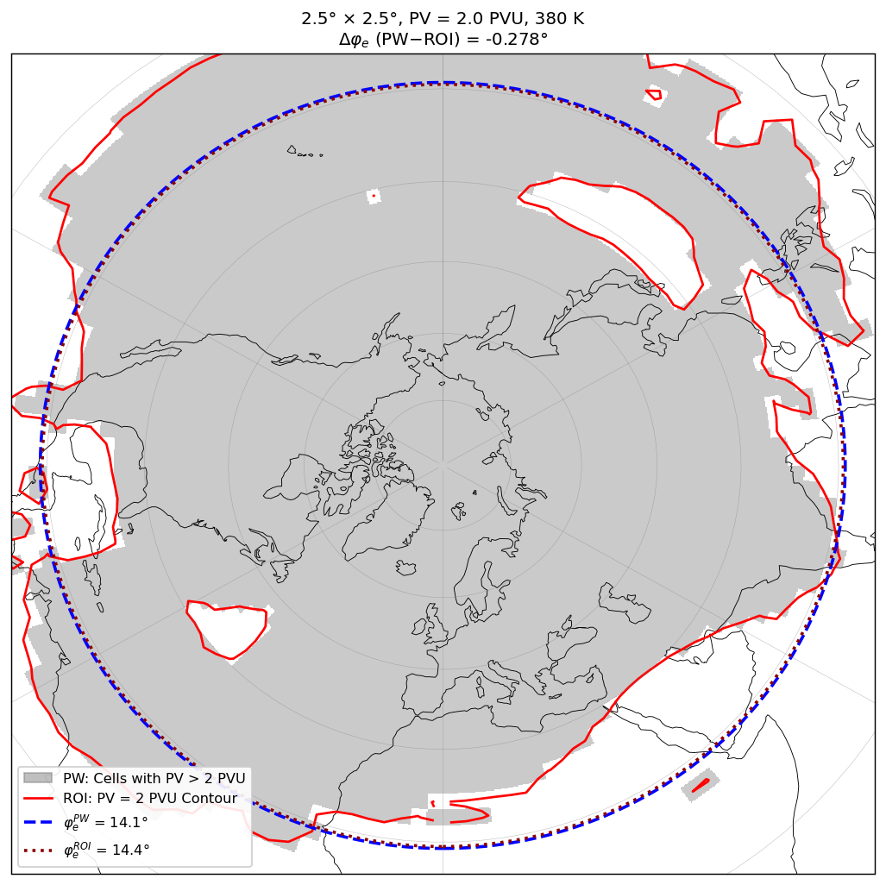
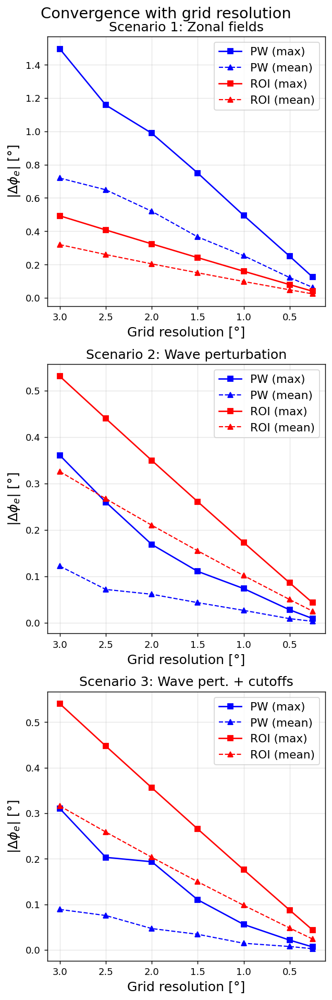
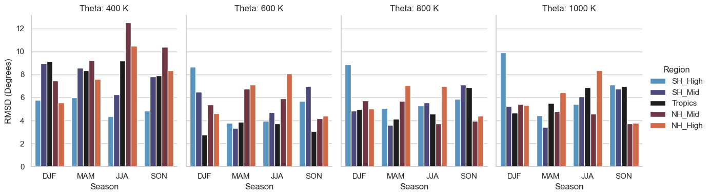
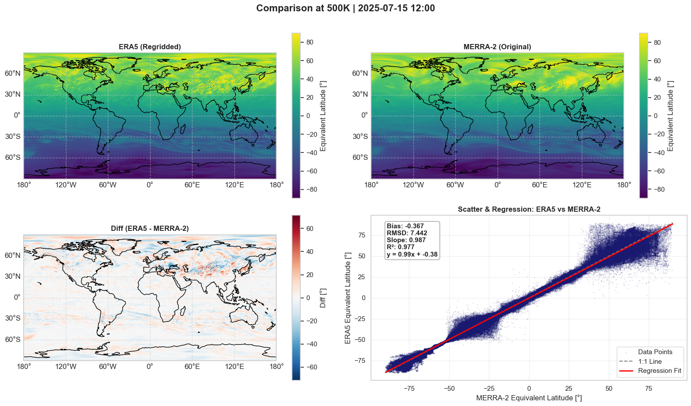
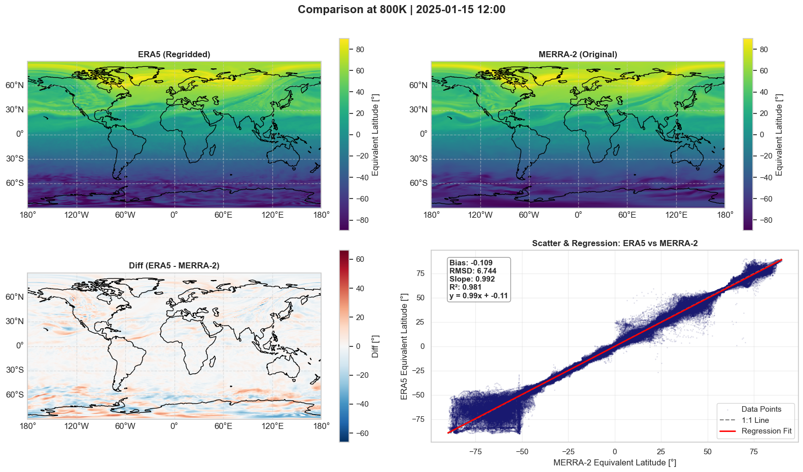
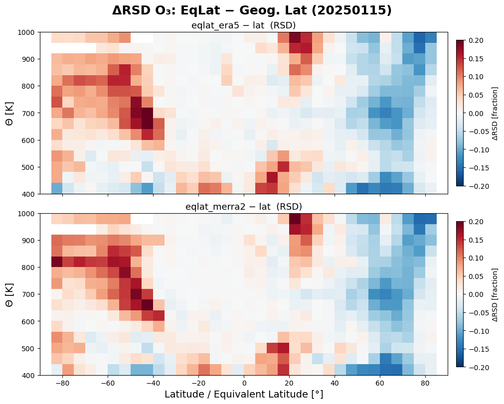
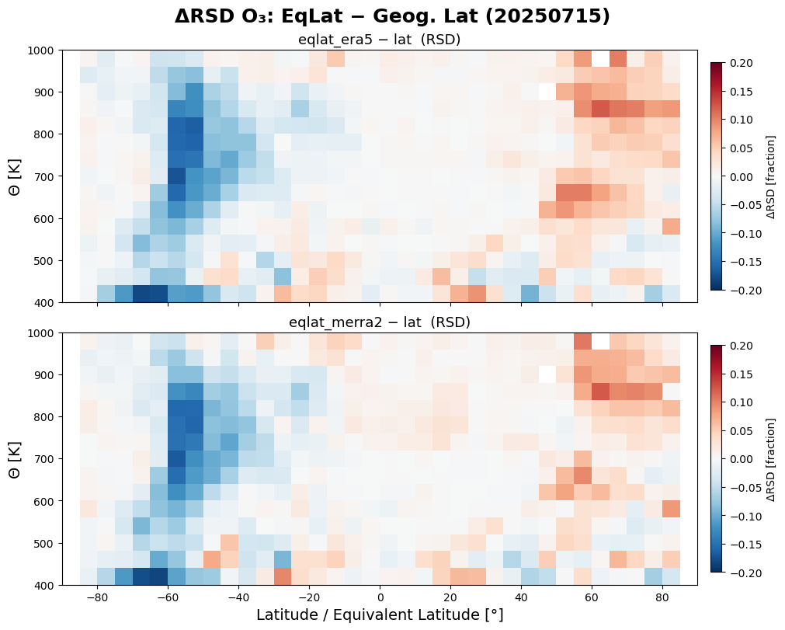
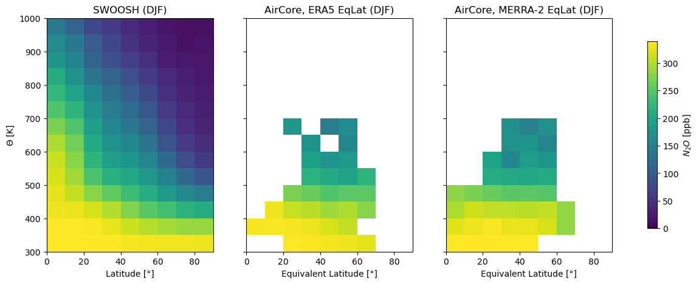
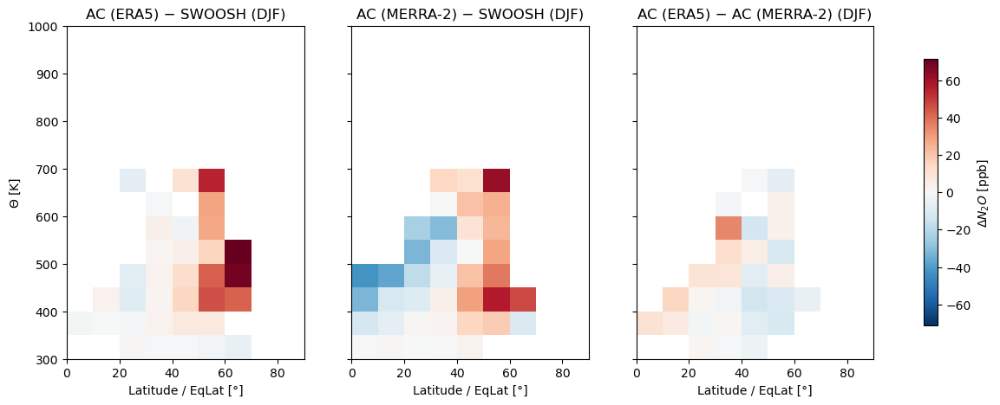

## Final Project: PV-based Equivalent Latitude Revisited

*Methodological differences and reanalysis dependence (ERA5 vs. MERRA-2)*

This page presents the final results of the equivalent latitude (EqLat) project first introduced in the [Earth Data Analytics Projects](eda_projects.html) page. 

### Motivation

Equivalent latitude is a quasi-Lagrangian coordinate: the geographic latitude that would enclose the same area as a given isoline of an atmospheric field, most commonly potential vorticity (PV) on an isentropic surface. Because it moves with the air rather than with a fixed geographic grid, EqLat separates dynamical variability from chemical change and is widely used to identify the polar vortex edge, to build climatologies from sparse aircraft and balloon data, and to compare model output with observations.

PV itself is not measured, it is a diagnostic derived from reanalysis wind and temperature fields, and it can be converted to EqLat in more than one way. This project asks three practical questions: which of the two existing EqLat algorithms is actually more accurate once applied to realistic, high-resolution atmospheric fields, how much does the choice of reanalysis product (ERA5 vs. MERRA-2) matter for the resulting EqLat and for the science built on top of it, and can we machine learning appraches to derive EqLat.

### Two ways to calculate EqLat

The traditional **piecewise-constant (PW) method** treats PV as constant within each grid cell and sums the area of all cells above a chosen PV threshold. Añel et al. (2013) proposed an alternative, the **region of interest (ROI) method**, which instead fits contour lines through the PV field and computes the exact area enclosed by each contour. Añel et al. argued that ROI should be more accurate, but the method has seen almost no use since. The following figure shows the two different methods.

To settle the question, both methods were tested against **idealized, analytically defined PV fields**: a purely zonal field, a zonal field with a wavy planetary-wave-like disturbance, and a more realistic version of the latter with twelve embedded cutoff highs and lows mimicking vortex filaments. Because these fields have a known, exact EqLat solution, the true error of each method can be measured directly, something that is impossible with real reanalysis data. The following figure schows the absolute differecne of the two methods for different grid resolutions.

The result reverses the original finding: for simple zonal fields ROI is indeed more accurate, but as soon as realistic wave structure and cutoffs are introduced, the **piecewise method consistently outperforms ROI**, with errors of order 0.01-0.03° versus 0.02-0.1° at today's typical reanalysis resolutions. The likely reason is that ROI's contour-fitting linearly interpolates between grid points, which systematically truncates the true PV isoline and introduces a small poleward bias, whereas the PW method's grid-cell errors partly cancel out ("dithering") once the PV contour meanders in longitude. At the resolutions of ERA5 and MERRA-2, the two methods converge to within a few thousandths of a degree, so in practice the choice of method barely matters, but the piecewise approach is used throughout the remaining analysis for its accuracy and speed.

### ERA5 vs. MERRA-2

EqLat was then calculated from [ERA5](https://rmets.onlinelibrary.wiley.com/doi/10.1002/qj.3803) and [MERRA-2](https://gmao.gsfc.nasa.gov/gmao-products/merra-2/) reanalyses for 2023-2025 on isentropic levels from 300 K to 1400 K, with ERA5 regridded to MERRA-2's coarser 0.5° x 0.625° grid for a fair comparison. The data was further devided by season and latitude ranges, as can be seen in the Figure below.

Across all seasons and levels, the two reanalyses agree well overall (R² typically 0.96-0.99), but the area-weighted RMSD between them is not uniform. The largest disagreements, often more than 8-12° of latitude, show up in the **respective summer hemisphere**, especially in the lower stratosphere (400-500 K). The explanation is dynamical rather than a data problem: without a strong polar vortex, the PV gradient across the summer hemisphere becomes very flat, so even small differences between the two reanalyses (resolution, assimilation scheme, input observations) translate into large EqLat differences. This is illustrated below for July 2025 at 500 K, where the two fields still show excellent 1:1 agreement in the scatter plot, but the difference map reveals substantial noise across the summer-hemisphere mid- and high latitudes.

The same case study for the winter hemisphere (800 K, January 2025) shows a cleaner picture over most of the globe, but reveals a distinct band of disagreement poleward of about 50°S, where sparse observations force both reanalyses to rely heavily on satellite data and their differing assimilation schemes (ERA5's 4D-Var vs. MERRA-2's 3D-Var/GSI) leave a visible fingerprint.

An unexpected side finding: ERA5 shows patchy, small-scale EqLat structure at 500 K directly over the Andes, Rockies, and especially the Himalayas during NH summer, in all three years studied. This traces back to ERA5's PV field itself and likely reflects how the two reanalyses resolve orographic and convective gravity waves differently, an interesting open question for future work.

### Does EqLat actually help?

The whole point of using EqLat is to reduce scatter in zonal-mean climatologies by grouping air masses with the same dynamical history rather than the same geographic latitude. This was tested using Aura MLS ozone, binned by both coordinates and compared using the relative standard deviation (RSD) within each bin.

The pattern is consistent and physically intuitive: EqLat clearly reduces variability in the **winter hemisphere** mid- and high latitudes, where the polar vortex edge is a real, sharp mixing barrier that PV contours capture well. In the **summer hemisphere**, however, EqLat tends to increase variability rather than reduce it, since the vortex has broken down, the PV gradient is weak, and ozone there is governed mainly by photochemistry rather than dynamics, so sorting by a noisy dynamical coordinate just adds scatter. In other words, EqLat is a genuinely useful coordinate, but only where the dynamical barrier it is meant to track actually exists.

### Work in progress: Connecting to NOAA AirCore and ozonesonde observations

The next part of the analysis is connection to in-situ data: Calculate PV-based EqLat for real balloon-borne observations. NOAA's AirCore system provides high-resolution N2O profiles from monthly flights out of Boulder, Colorado, complemented by ozonesonde profiles. Although all launches occur at a single geographic latitude, the sampled air masses vary considerably between more tropical and more polar characteristics, which is exactly the kind of variability EqLat is designed to sort out. EqLat calculated along the AirCore and ozonesonde profiles are compared against the NOAA SWOOSH merged-satellite climatology. This work is still in progress with AirCore data shown below (DJF only).

For December-February, the season where EqLat showed the strongest compactness gain, casting the Boulder AirCore profiles into EqLat coordinates reveals that these single-site launches effectively sample a much broader dynamical range, roughly 20-70°N in equivalent latitude, rather than the fixed ~40°N of the launch site. The AirCore-derived N2O zonal means agree reasonably well with SWOOSH, with differences of order 10-30 ppb in most bins, and the choice of reanalysis (ERA5 vs. MERRA-2) used to compute EqLat makes only a small additional difference compared to the AirCore-SWOOSH offset itself.

### Take-aways

The piecewise-constant method remains the more accurate and more practical choice for calculating EqLat from present-day reanalyses, contrary to the original 2013 recommendation favoring the region-of-interest method. ERA5 and MERRA-2 agree well as a rule, but diverge most where the PV gradient is weak, chiefly in the respective summer hemisphere and at high southern latitudes, so users should be cautious applying EqLat there. Used in the right regime, EqLat clearly earns its place as an analysis coordinate: it meaningfully tightens winter-hemisphere zonal means and lets single-site balloon programs like NOAA's AirCore sample a far wider range of dynamical states than their fixed launch location would suggest.

### Outlook: from reanalysis to machine learning

The identified piecewise method now serves as ground truth for the next phase (with Eric Ray, NOAA CSL, on NOAA HPC): predicting equivalent latitude directly from ozonesonde profiles via machine learning, rather than a full PV calculation. A CNN (profile shape) and a PINN (with PV-conservation constraints) are benchmarked against a random-forest baseline, with and without climate indices (QBO, ENSO, AO, AAO, solar cycle) as predictors. A successful model would give a fast, reanalysis-independent way to assign EqLat to sparse balloon and aircraft observations like AirCore; a null result would itself be informative about how much dynamical information ozone profiles actually carry.

##### Sources

Añel, J. A., Allen, D. R., Sáenz, G., Gimeno, L., and de la Torre, L.: Equivalent Latitude Computation Using Regions of Interest (ROI), PLOS ONE, 8, e72970, https://doi.org/10.1371/journal.pone.0072970, 2013.

Hersbach, H., et al.: The ERA5 global reanalysis, Quarterly Journal of the Royal Meteorological Society, 146, 1999-2049, https://doi.org/10.1002/qj.3803, 2020.

Gelaro, R., et al.: The Modern-Era Retrospective Analysis for Research and Applications, Version 2 (MERRA-2), Journal of Climate, 30, 5419-5454, https://doi.org/10.1175/jcli-d-16-0758.1, 2017.

Davis, S. M., et al.: The Stratospheric Water and Ozone Satellite Homogenized (SWOOSH) database, Earth System Science Data, 8, 461-490, https://doi.org/10.5194/essd-8-461-2016, 2016.

Millán, L. F., et al.: Exploring ozone variability in the upper troposphere and lower stratosphere using dynamical coordinates, Atmospheric Chemistry and Physics, 24, 7927-7959, https://doi.org/10.5194/acp-24-7927-2024, 2024.

Baier, B., Sweeney, C., Newberger, T., Higgs, J., Wolter, S., and NOAA Global Monitoring Laboratory: NOAA AirCore atmospheric sampling system profiles, https://doi.org/10.15138/6AV0-MY81, 2021.

[back](./)
